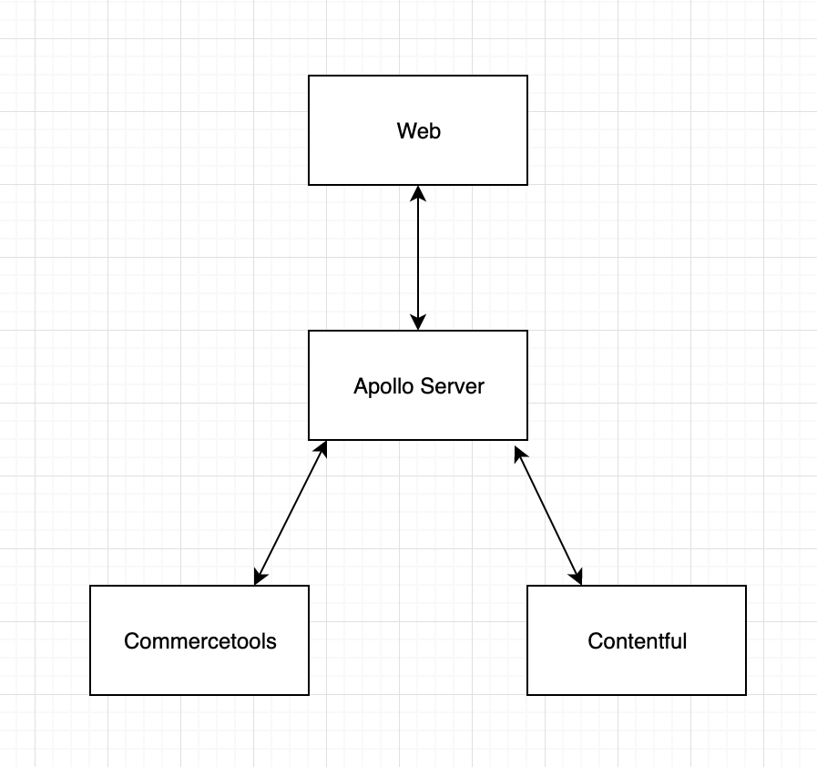

**DESCRIPTION**
-
This project creates a unified GraphQL schema from the following GraphQL APIs:

1. Contentful
2. Commercetools

This gives us the benefit of reducing multiple data queries for our data in a single request from one schema.

---
**Installation**
-

`git clone git@github.com:rukh93/apollo-server-stitching.git`\
`cd apollo-server-stitching`\
`npm install`\
`npm run dev`

---

**Contentful**
-
https://www.contentful.com/developers/docs/references/authentication/

---

**Commercetools**
-

https://docs.commercetools.com/merchant-center/api-clients

***COMMERCETOOLS_SCOPES*** config in the .env file should be with the following options:
1. Without a project key
2. Separator should be comma instead of space

***Example*** - manage_my_profile,manage_my_payments,manage_my_orders,create_anonymous_token
