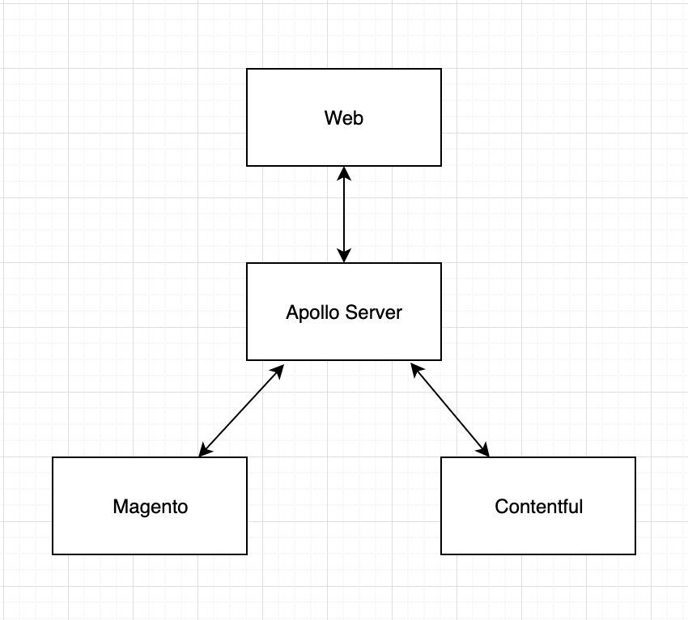

**DESCRIPTION**
-
This project creates a unified GraphQL schema from the following GraphQL APIs:

1. Contentful
2. Commercetools

This gives us the benefit of reducing multiple data queries for our data in a single request from one schema.

---
**Installation**
-

`git@github.com:rukh93/apollo-server-schema-merging.git`\
`cd apollo-server-schema-merging`\
`npm install`\
`npm run dev`

---

**Contentful**
-
By the following url you can find information regarding a token and space id:
https://www.contentful.com/developers/docs/references/authentication/

By the following url you can find information regarding graphql:
https://www.contentful.com/developers/docs/references/graphql/

Example of the contentful graphql endpoint:
https://graphql.contentful.com/content/v1/spaces/{SPACE}

Contentful .env file has key *CONTENTFUL_EXTENSION*.\
This extension renames your graphql objects in case if you have in two different schemas the same object names.\
Keep it empty if you don't have the same object names in two different schemas.\
For more information: https://www.graphql-tools.com/docs/schema-wrapping

---

**Commercetools**
-

https://docs.commercetools.com/merchant-center/api-clients

***COMMERCETOOLS_SCOPES*** config in the .env file should be with the following options:
1. Without a project key
2. Separator should be comma instead of space

***Example*** - manage_my_profile,manage_my_payments,manage_my_orders,create_anonymous_token

Commercetools .env file has key *COMMERCETOOLS_EXTENSION*.\
This extension renames your graphql objects in case if you have in two different schemas the same object names.\
Keep it empty if you don't have the same object names in two different schemas.\
For more information: https://www.graphql-tools.com/docs/schema-wrapping